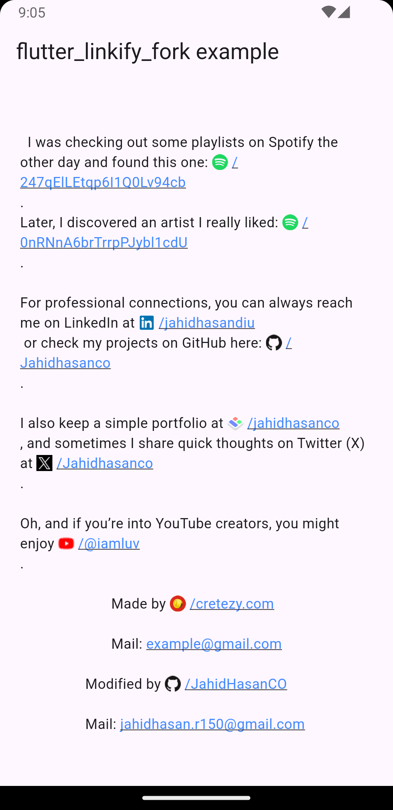

# `flutter_linkify_fork`

Turns text URLs and emails into clickable inline links in text for Flutter.
This package is a fork of the original [`flutter_linkify`](https://pub.dev/packages/flutter_linkify) package, and adds an extra feature: **favicon display before links**.

Required Dart >=2.17 (with null-safety support).

---

## Install

Add the dependency to your `pubspec.yaml`:

```yaml
dependencies:
  flutter_linkify_fork:
    git:
      url: https://github.com/JahidHasanCO/flutter_linkify_fork
      ref: [[tag]]

```

It is highly recommended that you also add a dependency on [`url_launcher`](https://pub.dev/packages/url_launcher) to open links in the browser/OS.

---

## Usage

### Basic Example

```dart
import 'package:flutter_linkify_fork/flutter_linkify_fork.dart';

Linkify(
  onOpen: (link) => print("Clicked ${link.url}!"),
  text: "Made by https://cretezy.com",
);
```

---

### Styling

Add custom styles for normal text and links, and open links in the browser using [`url_launcher`](https://pub.dev/packages/url_launcher):

```dart
import 'package:flutter_linkify_fork/flutter_linkify_fork.dart';
import 'package:url_launcher/url_launcher.dart';

Linkify(
  onOpen: (link) async {
    if (!await launchUrl(Uri.parse(link.url))) {
      throw Exception('Could not launch ${link.url}');
    }
  },
  text: "Made by https://cretezy.com",
  style: TextStyle(color: Colors.yellow),
  linkStyle: TextStyle(color: Colors.red),
);
```

All `RichText` options are available for use.

---

### Linkify Options

By default, humanization (removal of `http://` or `https://` from the start of
the URL) is enabled. You may disable it by passing `options`:

```dart
Linkify(
  text: "Made by https://cretezy.com",
  options: LinkifyOptions(humanize: false),
);
```

---

### Selectable Text

Use the `SelectableLinkify` widget to create selectable text.
All `SelectableText` options are available for use.

```dart
SelectableLinkify(
  text: "Made by https://cretezy.com\n\nMail: example@gmail.com",
);
```

---

### Favicon Support (New in Fork)

This fork introduces **favicon support**, allowing you to display a website’s favicon before the link text.
You can enable it with `useFavicon: true`.
Optionally, set `formatFaviconUrl: true` to normalize the favicon URL.

```dart
Linkify(
  onOpen: _onOpen,
  text: text,
  useFavicon: true,
  formatFaviconUrl: true,
),

Linkify(
  onOpen: _onOpen,
  text: "Made by https://cretezy.com\n\nMail: example@gmail.com",
  useFavicon: true,
  formatFaviconUrl: true,
),

const SizedBox(height: 20),

SelectableLinkify(
  onOpen: _onOpen,
  text: "Modified by https://github.com/JahidHasanCO\n\nMail: jahidhasan.r150@gmail.com",
  useFavicon: true,
  formatFaviconUrl: true,
),
```

---

### Advanced Usage

In the `onOpen` callback, a `LinkableElement` is passed in.
You can check if it is a `UrlElement` or `EmailElement` using `is` for custom handling.

You can also enable parsing of only some link types using the `linkifiers` option.
URL and email are enabled by default.

---

📌 A full example can be found at [`example/lib/main.dart`](example/lib/main.dart).


